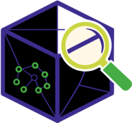

# Zolletta-metaskill

A family of generic code review skills with specializations for Python (other languages in progress).

_Zolletta_ is Italian for sugar cubes — each skill is a compact, self-contained piece that sweetens the review process. Together they dissolve into a complete picture.

Zolletta-metaskill is a **meta-skill**: it dispatches to subcommands that each perform a specific review task. It leverages [tokensave](https://github.com/aovestdipaperino/tokensave) when available for semantic code-graph queries, and falls back to grep + targeted reads otherwise.

## The `.agents/` convention

This skill lives under `~/.agents/skills/` and follows the emerging `.agents/` directory convention — a vendor-neutral, file-based standard for AI agent configuration. The convention defines a two-layer layout: global (`~/.agents/`) for user-wide rules and skills, and workspace (`./.agents/`) for project-specific overrides. Everything is plain text, git-friendly, and works across tools (Claude Code, Cursor, Codex, Devin, and others).

References:

- [agentsfolder/spec](https://github.com/agentsfolder/spec) — the AGENTS-1 specification (manifest, modes, policies, skills, scopes)
- [.agents Protocol](https://dotagentsprotocol.com/) — vendor-neutral protocol with two-layer global/workspace model
- [Agents Standard](https://agentsstandard.com/) — hierarchical `AGENTS.md` loading order (`~/.agents/` → `.agents/` → project root → subdirectory)

### Rules

All files in `~/.agents/rules/` are the single source of truth for their domain and apply to every subcommand. Sub-skills link back to them and only narrow behavior for their specific review context.

## Quick start

```text
/zolletta-metaskill                  # list available subcommands
/zolletta-metaskill setup            # initialize .zolletta-metaskill/settings.json
/zolletta-metaskill review           # full project review (orchestrator)
/zolletta-metaskill patterns         # design pattern analysis
/zolletta-metaskill documentor       # documentation review (Diátaxis + drift detection)
/zolletta-metaskill external-review  # external-LLM review of modified files
```

The first time you run any subcommand in a project, the **setup guard** automatically runs `/zolletta-metaskill setup` if `.zolletta-metaskill/settings.json` does not exist.

## Subcommands

| Subcommand                | Scope                                                                                                                                                                                |
| ------------------------- | ------------------------------------------------------------------------------------------------------------------------------------------------------------------------------------ |
| `setup`                   | Project initialization — creates `settings.json`, detects language, Docker container, tokensave, Python tooling, and extracts effective tool configuration from `pyproject.toml`     |
| `review`                  | Full project review orchestrator — runs general + language-specific skills as parallel subagents, produces graded SUMMARY.md and aggregated TODO.md with links to specialist reports |
| `patterns`                | God classes, SOLID violations, coupling, composition vs inheritance for `src/`                                                                                                       |
| `documentor`              | [Diátaxis](https://diataxis.fr/) compliance + drift detection for `.backstage/`                                                                                                      |
| `external-review`         | External-LLM code review on modified files only (default model: `swe`)                                                                                                               |
| `python-code-style`       | Python source code style review (ruff, mypy, naming, docstrings, type annotations) — adapted from [wshobson/agents](https://github.com/wshobson/agents) (MIT)                        |
| `python-testing-patterns` | Python test code review (isolation, naming, coverage gaps, mocking, fixtures, AAA structure) — adapted from [wshobson/agents](https://github.com/wshobson/agents) (MIT)              |

## Tools leveraged if available

| Tool      | Homepage                                      | Why zolletta-metaskill benefits                                                                                                                                                                                                                |
| --------- | --------------------------------------------- | ---------------------------------------------------------------------------------------------------------------------------------------------------------------------------------------------------------------------------------------------- |
| tokensave | https://github.com/aovestdipaperino/tokensave | Semantic code-graph index (symbols, call/callee, impact radius). Used by patterns, documentor, review, external-review to understand code without reading full files, assess blast radius, verify documented symbols, and find affected tests. |

When a tool is not installed, zolletta-metaskill prints a message explaining why it would benefit from the tool and links to the homepage. It does **not** install anything.

## Shared resources

| Resource   | Path              | Contents                                                                                                                                                                    |
| ---------- | ----------------- | --------------------------------------------------------------------------------------------------------------------------------------------------------------------------- |
| References | `reference/`      | Code-exploration decision tree, general principles, Python review guide, scripts reference, documentation standards, tool messages, review-mode rules, settings.json schema |
| Scripts    | `scripts/python/` | Automated scanning scripts used by multiple skills                                                                                                                          |

## Setup and settings.json

`/zolletta-metaskill setup` creates `.zolletta-metaskill/settings.json` in the project root and adds `.zolletta-metaskill/` to `.gitignore`. The file is read by all other subcommands.

For the full schema, field-by-field documentation, the `python_config`, `python_code_style_rules`, and `python_testing_patterns_rules` blocks, and the setup guard staleness check, see [`reference/settings-schema.md`](reference/settings-schema.md).

### Setup guard

Before dispatching to any subcommand, the meta-skill checks for `.zolletta-metaskill/settings.json`:

1. If it **exists**, read it and proceed.
2. If it **does not exist**, run the full setup procedure first.
3. If the user invoked `/zolletta-metaskill setup` explicitly, run setup and stop.

For Python projects, the guard also performs a **staleness check**: if `pyproject.toml`'s modification time differs from `python_config.pyproject_mtime` in `settings.json`, the guard re-runs only the pyproject extraction step and patches `python_config` — full setup is not re-run.

### Tool-failure handler

If any subcommand calls a tokensave MCP tool and receives a tool-not-found / server-not-found error, it:

1. Updates `tokensave_available` in `settings.json` to `false`
2. Prints the "not installed" message from `reference/tool-messages.md`
3. Continues with grep + targeted reads as fallback (for graph tools). Python skills (`python-code-style`, `python-testing-patterns`) are bundled inside this meta-skill and are always available — the "not found" case does not apply to them.

## Reports

All reports are saved to:

```text
.zolletta-metaskill/reports/<YYYY-MM-DD-HH-MM>/<subcommand>.md
```

The timestamp format (`YYYY-MM-DD-HH-MM`) is lexicographically sortable, so finding the most recent review is a simple directory listing.

## False-positive prevention

The patterns skill includes three mechanisms to prevent verdict oscillation between reviews:

1. **Mandatory judgment step for God class detection** — `scan_class_metrics.py` reports class size as a triage signal, never a verdict. Before reporting any class as a God class, the reviewer must apply the "reason to change" test: list every change that could require editing the class, group by domain, and only report if there are reasons from **different domains**. Classes that are parsers, strategies, orchestrators, or factories serving a single domain are explicitly suppressed. See `patterns/SKILL.md` → "Mandatory Procedure".

2. **Coverage cross-check for missing tests** — `scan_tests.py` reports structurally missing test files. Before reporting any as a finding, the reviewer must run `pytest --cov` and check the file's coverage. Files with >50% coverage are downgraded to informational — they are tested indirectly. Only files with <50% coverage AND no indirect references are reported as findings.

3. **Semantic composition-root detection** — `scan_dependency_inversion.py` excludes classes that create DI containers (`make_container()`, `Container()`, etc.) as composition roots, regardless of filename. This prevents false positives on classes like `CITesterEngine` that wire the DI container but don't match entry-point filename patterns.

## Rules

All files in `~/.agents/rules/` are the **single source of truth** for their domain and apply to every subcommand. Sub-skills link back to them and only narrow behavior for their specific review context.

## License

MIT + Commons Clause. See `SKILL.md` frontmatter in each subcommand.

## Attributions

- **[wshobson/agents](https://github.com/wshobson/agents)** (MIT, Copyright (c) 2024 Seth Hobson) — `python-code-style` and `python-testing-patterns` skills adapted from the original Python review agents. Design pattern principles in `patterns` also adapted from wshobson's python-design-patterns
- **[Diátaxis Documentation Expert](https://github.com/github/awesome-copilot/blob/main/skills/documentation-writer/SKILL.md)** (MIT, github/awesome-copilot) — `documentor` skill derived from this documentation review skill
- **[Doc Drift Detector](https://github.com/borghei/Claude-Skills/blob/main/engineering/doc-drift-detector/SKILL.md)** (MIT + Commons Clause, borghei/Claude-Skills) — drift detection pipeline in `documentor` derived from this skill
- **[Diátaxis](https://diataxis.fr/)** — documentation framework used by the `documentor` subcommand for structure compliance checks
- **[tokensave](https://github.com/aovestdipaperino/tokensave)** — semantic code-graph MCP server leveraged for code exploration when available

## Changelog

See [CHANGELOG.md](CHANGELOG.md).
