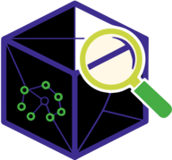

# Zolletta-metaskill

[](https://github.com/Zolletta/zolletta-metaskill/actions/workflows/tests.yml)
[](https://codecov.io/gh/Zolletta/zolletta-metaskill/branch/main)
[](https://www.python.org/downloads/)
[](LICENSE)
[](https://github.com/Zolletta/zolletta-metaskill/pulls)
[](https://metaskill.zolletta.org/)
[](https://github.com/Zolletta/zolletta-metaskill/releases)

A family of generic code review skills with specializations for Python and PHP (other languages in progress).

_Zolletta_ is Italian for sugar cubes — each skill is a compact, self-contained piece that sweetens the review process. Together they dissolve into a complete picture.

Zolletta-metaskill is a **meta-skill**: it dispatches to subcommands that each perform a specific review task. It leverages [tokensave](https://github.com/aovestdipaperino/tokensave) when available for semantic code-graph queries, and falls back to grep + targeted reads otherwise.

📖 **Full documentation**: <https://metaskill.zolletta.org/>

## The `.agents/` convention

This skill lives under `~/.agents/skills/` and follows the emerging `.agents/` directory convention — a vendor-neutral, file-based standard for AI agent configuration. The convention defines a two-layer layout: global (`~/.agents/`) for user-wide rules and skills, and workspace (`./.agents/`) for project-specific overrides. Everything is plain text, git-friendly, and works across tools (Claude Code, Cursor, Codex, Devin, and others).

References:

- [agentsfolder/spec](https://github.com/agentsfolder/spec) — the AGENTS-1 specification (manifest, modes, policies, skills, scopes)
- [.agents Protocol](https://dotagentsprotocol.com/) — vendor-neutral protocol with two-layer global/workspace model
- [Agents Standard](https://agentsstandard.com/) — hierarchical `AGENTS.md` loading order (`~/.agents/` → `.agents/` → project root → subdirectory)

### Rules

If you maintain rules as part of your agent configuration, those are the single source of truth for their domain and apply to every subcommand. Sub-skills link back to them and only narrow behavior for their specific review context.

## Quick start

```text
/zolletta-metaskill                  # list available subcommands
/zolletta-metaskill setup            # initialize .zolletta-metaskill/settings.json
/zolletta-metaskill review           # full project review (orchestrator)
/zolletta-metaskill patterns         # design pattern analysis
/zolletta-metaskill documentor       # documentation review (Diátaxis + drift detection)
/zolletta-metaskill external-review  # external-LLM review of modified files
```

The first time you run any subcommand in a project, the **setup guard** automatically runs `/zolletta-metaskill setup` if `.zolletta-metaskill/settings.json` does not exist.

New to Zolletta-metaskill? Read the [getting started tutorial](https://metaskill.zolletta.org/tutorials/getting-started/).

## Usage

### Full review

Run `/zolletta-metaskill review` to orchestrate all subcommands in parallel. The orchestrator:

1. Runs the **setup guard** — creates or refreshes `.zolletta-metaskill/settings.json` if needed.
2. Distills ADRs into architectural directives (`adr-distiller`).
3. Launches subagents for each review area (patterns, code style, testing style, documentor).
4. Aggregates results into a grade, summary, and TODO file under `.zolletta-metaskill/reports/<YYYY-MM-DD-HH-MM>/`.

### Individual subcommands

Each subcommand can be run standalone for targeted review:

| Subcommand             | What it does                                                              |
|------------------------|---------------------------------------------------------------------------|
| `setup`                | Detect language, tools, Docker container, tokensave — write settings.json |
| `patterns`             | SOLID, God classes, coupling, composition vs inheritance                  |
| `documentor`           | Diátaxis compliance + drift detection (staleness, links, API validation)  |
| `external-review`      | Send modified files to an external LLM for review                         |
| `adr-distiller`        | Distill Accepted ADRs into `adr-distilled.md` directives                  |
| `python-code-style`    | Python source style (ruff, mypy, naming, docstrings, types)               |
| `python-testing-style` | Python test code (isolation, naming, coverage, mocking, fixtures)         |
| `php-code-style`       | PHP source style (PSR-12, naming, one class per file, PHPDoc)             |
| `php-testing-style`    | PHP test code (PHPUnit naming, mirroring, coverage, mocking)              |

### Report output

All reports are saved to `.zolletta-metaskill/reports/<YYYY-MM-DD-HH-MM>/`:

- `SUMMARY.md` — executive summary with overall grade and trend
- `TODO.md` — prioritized action items
- `<subcommand>.md` — detailed findings per review area

See the [example review report](https://metaskill.zolletta.org/reference/example-review-report/) for a real output.

### Supported languages

| Language | Parser                                                            | SOLID scanners     | Code style          | Testing style          |
|----------|-------------------------------------------------------------------|--------------------|---------------------|------------------------|
| Python   | [ast](https://docs.python.org/3/library/ast.html) module (stdlib) | DIP, ISP, OCP, LSP | `python-code-style` | `python-testing-style` |
| PHP      | [tree-sitter-php](https://github.com/tree-sitter/tree-sitter-php) | DIP, ISP, OCP      | `php-code-style`    | `php-testing-style`    |

## Installation

### One-command installer (recommended)

```bash
git clone https://github.com/Zolletta/zolletta-metaskill.git
cd zolletta-metaskill
./install.sh
```

The `install.sh` script copies the skill to `~/.agents/skills/zolletta-metaskill` and symlinks it into every detected AI agent tool's skills directory (Claude Code, Cursor, Gemini CLI, Devin, Windsurf, and others). See the [install guide](https://metaskill.zolletta.org/how-to/install/) for details and manual alternatives.

## Contributing

See [CONTRIBUTING.md](CONTRIBUTING.md) for development setup, testing, and the quality gate.

## Reference

- **[Subcommands](https://metaskill.zolletta.org/reference/subcommands/)** — full list of `setup`, `review`, `patterns`, `documentor`, `external-review`, and language-specific skills with their scope.
- **[Settings schema](https://metaskill.zolletta.org/reference/settings-schema/)** — field-by-field reference for `.zolletta-metaskill/settings.json`, including the `python` and `php` objects, `acronyms` array, and setup guard staleness check.
- **[Reports](https://metaskill.zolletta.org/reference/reports/)** — report file format and templates. Reports are saved to `.zolletta-metaskill/reports/<YYYY-MM-DD-HH-MM>/<subcommand>.md`.
- **[Tool messages](https://metaskill.zolletta.org/reference/tool-messages/)** — "not installed" messages for the tool-failure handler.
- **[tokensave](https://metaskill.zolletta.org/reference/code/tokensave/)** — semantic code-graph MCP server leveraged for code exploration when available.

## Explanation

- **[False-positive prevention](https://metaskill.zolletta.org/explanation/code/false-positive-prevention/)** — the three mechanisms (mandatory judgment step, coverage cross-check, semantic composition-root detection) that prevent verdict oscillation between reviews.
- **[General principles](https://metaskill.zolletta.org/explanation/code/general-principles/)** — SOLID, KISS, composition over inheritance, God class detection.
- **[Documentation standards](https://metaskill.zolletta.org/explanation/documentation/standards/)** — docs-as-code principles and the four types of documentation.

## License

MIT + Commons Clause. See [LICENSE](LICENSE) and the `license` field in each subcommand's `SKILL.md` frontmatter.

## Attributions

- **[wshobson/agents](https://github.com/wshobson/agents)** (MIT, Copyright (c) 2024 Seth Hobson) — `python-code-style` and `python-testing-style` skills adapted from the original Python review agents. Design pattern principles in `patterns` also adapted from wshobson's python-design-patterns
- **[Diátaxis Documentation Expert](https://github.com/github/awesome-copilot/blob/main/skills/documentation-writer/SKILL.md)** (MIT, github/awesome-copilot) — `documentor` skill derived from this documentation review skill
- **[Doc Drift Detector](https://github.com/borghei/Claude-Skills/blob/main/engineering/doc-drift-detector/SKILL.md)** (MIT + Commons Clause, borghei/Claude-Skills) — drift detection pipeline in `documentor` derived from this skill
- **[Diátaxis](https://diataxis.fr/)** — documentation framework used by the `documentor` subcommand for structure compliance checks
- **[tokensave](https://github.com/aovestdipaperino/tokensave)** — semantic code-graph MCP server leveraged for code exploration when available
- **[Architectural Governance at AI Speed](https://www.infoq.com/articles/architectural-governance-ai-speed/)** (InfoQ, 2026) — ADR distiller design inspired by this article's declarative architectural governance approach

## Changelog & Documentation

- **Releases**: https://github.com/Zolletta/zolletta-metaskill/releases — automated via [python-semantic-release](https://github.com/python-semantic-release/python-semantic-release)
- **Documentation**: https://metaskill.zolletta.org/ — built with [MkDocs Material](https://squidfunk.github.io/mkdocs-material/) and deployed to GitHub Pages
